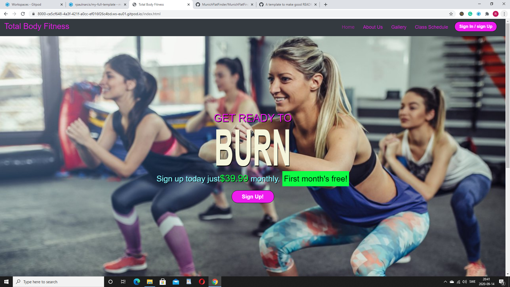
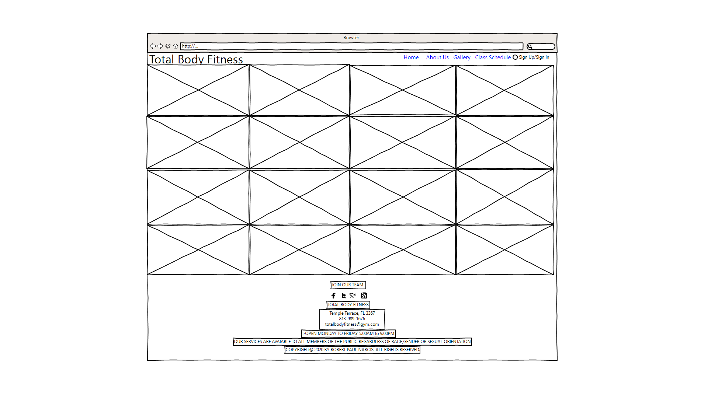

MileStone README.md

### **My First Milestone Project**

Welcome! [View live project here](https://rpaulnarcis.github.io/milestone1/)

Milestone Project Home Page

### **UX - User Experience Design:**
This website was created for the Total Body Fitness GYM, the goal is to keep their existing members while attracting new membership, through their competitive price and quality service. Qualified Instructors will be running daily programs; members can attend all or specific classes as they see fit. Through this project, I offer strong advertising, through typography, colors, and easy navigational tools. Engaging existing customers, improving customer satisfaction through better service, simplifying and optimizing content updates, and website management, to grow the company and, increase profitability.

#### User Stories
- As a first - time visitor, I want to easily understand the project from the moment I get to the landing page.
- As a first - time visitor, I want to easily be able to navigate, be able to go back and forth to pages quickly.
- As a first - time visitor, I want the project to not be too exhausting to look at.
- As a first - time visitor, I want to able to pick back up from where I left off, so I can simply just carry on if I took a break? 
- As a first - time visitor, I would like to be able to create a new account.
- As an existing - user, I would like to be able to log into the gym's website.

#### Wireframes, mockups, diagrams, etc

#### Wireframe 1:
Home Page 
#### Wireframe 2:
About Us Page
#### Wireframe 3:
Gallery Page
#### Wireframe 4:
Gallery Page

### **Features:**
#### Features presented across the project
- Navbar - Responsive, toggles to a hamburger menu at a width of 575 pixels. All links are a bright pink but go to a dark pink once clicked. There are links to all of the pages as well as a sign-in/sign-up button. The main logo acts as a link back to the home page.
- Footer comprises of social links, contact information, as well as hours of operation.
- Consistent images are used throughout the project, which gives it a humane feel and helps to invoke user emotions. All images are relevant to the content.
- The contrast of fonts between header and proceeding text, both Roboto and Exo help bring the page to life.
#### Features presented on individual pages
#### Home page
- A large hero image on the main page to draw the user's attention the call-out information fills the center of the hero image with bright green color outlining the cost of the service, encouraging members to join, accompanied by a Sign-Up button.
#### About us page 
- Consists of, two background images that depict the strength and power of women. At the top, we have our mission statement with an inspirational quote of our dedication to our members. At the bottom, we have detailed information on what our work-out programs consist of.
#### Gallery page
-  A photo layout of our members working-out and having fun is displayed in the gallery area.
#### Class schedule page
- Consists of, A detailed exercise class schedule, displaying the weekly layout of the days, times, exercise programs, durations, and instructors.
#### Features Left to Implement
- Once I have some understanding of JavaScript, I would like to implement it into this project to make it more interactive and less static.
- Some form of validation for users who sign up or sign in. 
- Genuine Web domain and custom URL. Would help the user experience seeing a more professional looking URL.

### **Technologies Used:**
- [HTML](https://developer.mozilla.org/en-US/docs/Web/HTML)
    - Used as the building block for the project and to structure the content.
- [CSS](https://developer.mozilla.org/en-US/docs/Learn/Getting_started_with_the_web/CSS_basics)
    - Used to style all the web content across the project.
- [Bootstrap](https://getbootstrap.com/)
    - Used as the main framework to make the project responsive.
- [jQuery](https://jquery.com/)
    - Used with Bootstrap to make the navbar responsive.
- [JavaScript](https://www.javascript.com/)
    - Used for the Bootstrap navbar extending collapse plugin to implement responsive behavior.
- [Google Fonts](https://fonts.google.com/)
    - Used to obtain the fonts linked in the header, fonts used were Roboto and Exo.
- [Font Awesome](https://fontawesome.com/)
    - Used to obtain social media icons used in the footer.
- [Google Developer Tools](https://developers.google.com/web/tools/chrome-devtools)
    - Used as a primary method of fixing spacing issues, finding bugs, and testing responsiveness across the project.
- [Github](https://github.com/)
    - Used to store code for the project after being pushed.
- [Git](https://git-scm.com/)
    - Used for version control by utilizing the Gitpod terminal to commit to Git and push to GitHub.
- [Gitpod](https://www.gitpod.io/)
    - Used as the development environment.
- [WireframeSketcher](https://wireframesketcher.com/)
    - Used to create Wireframes for the project.
- [AutoPrefixer](https://autoprefixer.github.io/)
    - Used to parse my CSS and vendor prefixes.
- [Grammarly](https://app.grammarly.com/)
    - Used to fix grammar errors across the project.    

### **Testing:**

#### User testing stories from User Experience Design (UX) Section
- A large hero image of women exercising is on the main page and the large call-out information boldly suggests burning fat and building muscle through exercise.
- All pages are easily navigated back and forth via the easy to use navigational links placed in the navbar at the top of all pages.
- The textual information is not extensive and is to the point. Also, the bright colors used at times will keep the user engulfed.
- The project site is of a simple layout, one should not have a problem picking up where they left off.
- Creating a new account is very simple it can be done in two places on the main page by clicking on the sign-up button at the center of the page as well as a sign-in/log-up button in the navbar. On every other page, it can be done by clicking the sign-in/log-up button in the navbar.
- Logging is a very simple process, it can be done by clicking on the sign-in / sign-up button in the navbar at the top of all pages

#### Further Testing
- The project was tested on the following browsers with success, Google Chrome, Microsoft Edge,  Mozilla Firefox, and Opera.
- The project was manually tested on  Apple iPhone XS Max and a  Nexus 5X with success.
- Google Chrome Developer tools and responsivetesttool.com were used throughout the project to help with responsiveness across devices.
- Google Chrome Development tools and responsivetesttool.com used to emulate devices.

 - Mobile
    - Galaxy S5
    - Nexus 10
    - Nexus 4
    - Nexus 5
    - Nexus 5X
    - 411 x 731 [ Nexus 6P ]
    - iPhone 5
    - iPhone 8
    - 414 x 736 [ Apple iPhone 6s Plus/7 Plus ]
    - 414 x 896 [ Apple iPhone XR ]
    - 375 x 667 [ Apple iPhone 6/6s/7 ]
    - iphone X- 411 x 731 [ Google Pixel XL ]
    - 411 x 731 [ Google Pixel 2 XL ]
    - 360 x 640 [ LG G4 ]- 400 x 640 [ Samsung Galaxy Note ]
    - Samsung Galaxy Note

- Tablet

    - iPad 1
    - iPad 2
    - iPad Mini- Microsoft Surface
    - Apple iPad Pro- Apple iPad Pro 9.7 
    - Amazon Kindle Fire HD 8.9- Samsung Nexus 10
    - Apple iPad 3, 4, Air, Air2
    - 768 x 1024 [ HTC Nexus 9 ]

- Laptop / Desktop

    - 1440 x 900 [ Desktop/Laptop ]
    - 1280 x 800 [ Desktop/Laptop ]
    - 1024 x 768 [ Desktop/Laptop ]
    - 1680 x 1050 [ Desktop/Laptop ]

#### Syntax - HTML & CSS
<i class="far fa-clone"></i> Using https://validator.w3.org and filtering errors related to Angular (ex: no doctype,...)
- index.html (Home) &check;
- aboutus.html &check;
- gallery.html &check;
- classschedule.html &check;

<i class="far fa-clone"></i> Using https://jigsaw.w3.org/css-validator/ I validated the following spreadsheet:

- defaultStylesheet.css: &check;

#### Navigation
#### Navigation on Mobile
-  On mobile, the menu is collapsed when I start.
-  The menu opens and droops down when I click on the hamburger icon.
- Only four links are present.- All four links work.
- The menu collapsed back when I click on all four links.
- The menu collapsed back when I click on the hamburger menu.
- All four links work.
#### Navigation on Tablet:
- The menu is not collapsable no hamburger is present.
- There are four links.
- All four links work.
#### Navigation on Desktop
- The menu is not collapsable no hamburger is present.
- There are four links.
- All four links work.
- There is also a button after the fourth link which comprises a Sign-Up / Log-In button.
#### Sign-Up /Sign button
- Try to submit the form with an invalid email address and an error message appears asking for @ to be included.
#### Known Bugs and fixes
- I encountered a bug where the hamburger button icon was not invisible on me it is there but without the three lines, I was not able to solve this bug instead I used font Awsome and pasted in a substitute icon to represent it.

- On iPhone 5 the class schedule page appaired too wide it was fixed by adjusting all classes to padding-left 5px in media query max-width 320.
- Images in the gallery appaired stretched on various devices this was fixed by changing the width in Gallery div CSS from 400px to 360px.
### **Deployment:**
- I Configured my milestone 1 Project Total Budy Fitness website to display to GitHub pages and any file or files I push to the master.
#### Deployment Process
- Opened up GitHub in the browser.
- Signed in with my username and password.
- Selected my repositories.
- Navigated to rpnarcis/milestone1.
- In the top navigation click settings.
- Scrolled down to the GitHub Pages area.
- Selected Master Branch from the Source dropdown menu.
- Clicked to confirm my selection.
- rpaulnarcis/milestone1 is now live on GitHub Pages.
- Your site is published at https://rpaulnarcis.github.io/milestone1/

### **Authors:**
- This project was created by Robert P Narcis an upcoming full-stack software developer.
### **Credits:**
- Responsive image code used on both images in the about page taken from Thanveer Shah Slack.
- Code used for building the gallery on the gallery page taken from Codegrid.com.
- Code used to fix the screen from moving when on mobile taken from Vlad Alivanov Slack.
- Molal code was taken from Whiskey Drop Bootstrap code.- Button code taken from Whiskey Drop Bootstrap code.- All other coding was done by Robert Narcis. 
### **Content:**
- The Home page Call Out banner text taken from colorlib Blog 18 Best Gym Websites Design Inspiration 2020.
- The mission statement and all text after exercise programs on the About Us page is taken from Primal 7 website about us page.- Exercise programs and definitions on the About Us page is taken from Shapes Fitness for Women website class schedule page.- Class Schedule information text and layout is taken from Shapes Fitness for Women website class schedule page.
### **Media:**
- All images are random images from the internet.
### **Acknowledgements:**
- I received inspiration from the Whiskey Drop website project.
- I received inspiration from the Love Running website project.
- I received inspiration from the Shapes Fitness for Women website
